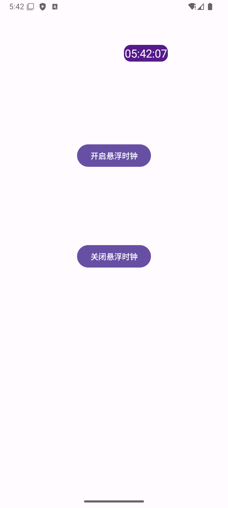

# 悬浮时钟工具箱 (Floating Clock Toolkit)

一款功能丰富的 Android 实用工具应用，集成了悬浮时钟、二维码扫描、照片拼图和照片水印等多项实用功能。



## ✨ 主要功能

### 1. 📱 悬浮时钟

实时显示在屏幕上方的悬浮时钟，适用于各种场景：

- **悬浮显示**：时钟窗口始终在其他应用之上显示
- **自由拖动**：可以随意拖动时钟位置到屏幕任意位置
- **大小调节**：支持通过缩放手柄自由调整时钟显示大小
- **实时更新**：时间精确到秒，实时刷新显示
- **省电模式**：使用 WakeLock 技术，在保持显示的同时优化电量消耗
- **便捷控制**：点击时钟可显示/隐藏控制按钮（缩放、关闭等）
- **完美秒杀**：适合电商秒杀、抢票等需要精确时间的场景

### 2. 📷 二维码扫描

强大的二维码和条形码扫描工具：

- **实时扫描**：使用相机实时识别二维码和条形码
- **自动对焦**：支持相机自动对焦，确保扫描准确性
- **闪光灯控制**：可开启/关闭闪光灯辅助扫描
- **扫描区域指示**：屏幕上显示扫描框，引导用户对准目标
- **多种格式支持**：支持 QR Code、EAN、UPC 等多种格式
- **智能识别**：扫描后自动识别内容类型（网址、文本等）
- **快速响应**：扫描成功后立即显示结果

### 3. 🧩 照片拼图

专业的照片拼图制作工具，支持多张照片组合：

#### 基础拼图功能
- **多种布局模板**：提供多种预设拼图布局样式
- **自由选择照片**：从相册中选择多张照片进行拼图
- **自动适配**：照片自动适配拼图格子大小
- **预览编辑**：实时预览拼图效果

#### 增强拼图功能（Enhanced）
- **拖拽排序**：支持拖拽方式调整照片在拼图中的位置
- **长按交换**：长按照片可与其他照片位置互换
- **缩放调整**：每张照片支持独立缩放和位置调整
- **边距设置**：可自定义照片间的边距大小
- **背景颜色**：支持设置拼图背景颜色
- **高质量导出**：导出的拼图图片保持高清晰度
- **拼图设置**：可调整列数、边距等参数
- **三种拼接模式**：
  - 横向拼接：照片水平排列
  - 纵向拼接：照片垂直排列  
  - 宫格拼接：照片按网格排列

### 4. 💧 照片水印

智能的照片水印添加工具，基于 EXIF 信息：

#### EXIF 信息读取
- **自动读取 EXIF**：自动提取照片的拍摄信息
- **丰富的信息字段**：
  - 拍摄时间（日期和时间）
  - GPS 位置信息（经纬度、地址）
  - 相机型号和厂商
  - 镜头信息
  - 光圈、快门、ISO 等拍摄参数
  - 焦距信息
  - 图片尺寸和分辨率
  - 文件大小

#### 快速水印模式
- **一键添加**：快速模式默认添加拍摄时间和 GPS 位置
- **智能排版**：水印信息自动格式化排列

#### 自定义水印编辑
- **字段选择**：从 EXIF 信息列表中自由选择要显示的字段
- **拖动定位**：水印可以自由拖动到照片任意位置
- **大小调整**：支持调整水印文字大小
- **内容编辑**：可以手动编辑水印文字内容
- **实时预览**：编辑时实时查看水印效果

#### 高质量导出
- **原始分辨率**：导出照片保持原始分辨率
- **保留画质**：确保添加水印后照片清晰度不降低
- **保存到相册**：处理后的照片自动保存到系统相册

### 5. 🎨 布局编辑器

可视化的拼图布局编辑工具：

- **网格编辑**：通过网格方式设计拼图布局
- **单元格合并**：支持合并相邻单元格创建不同大小的照片区域
- **布局预览**：实时预览设计的布局效果
- **自定义模板**：可将设计的布局保存为模板供后续使用

## 📋 系统要求

- **Android 版本**：Android 6.0 (API 23) 及以上
- **权限要求**：
  - 悬浮窗权限（SYSTEM_ALERT_WINDOW）：用于显示悬浮时钟
  - 相机权限（CAMERA）：用于二维码扫描
  - 屏幕常亮权限（WAKE_LOCK）：保持时钟显示

## 🚀 使用方法

### 悬浮时钟使用

1. 打开应用，点击"开启悬浮时钟"按钮
2. 首次使用需要授予悬浮窗权限
3. 时钟将显示在屏幕上方
4. 拖动时钟可以移动位置
5. 点击时钟显示控制按钮：
   - 拖动缩放手柄可以调整大小
   - 点击关闭按钮结束悬浮显示
6. 也可以在主界面点击"关闭悬浮时钟"按钮停止服务

### 二维码扫描使用

1. 点击"二维码扫描"按钮
2. 首次使用需要授予相机权限
3. 将二维码/条形码对准屏幕中央的扫描框
4. 系统自动识别并显示结果
5. 可点击闪光灯按钮辅助弱光环境扫描

### 照片拼图使用

1. 点击"照片拼图"按钮进入拼图功能
2. 从相册中选择要拼接的照片
3. 选择拼接模式（横向/纵向/宫格）
4. 调整拼图参数（列数、边距等）
5. 可以通过拖拽调整照片位置
6. 长按照片可以交换位置
7. 点击保存导出拼图图片

### 照片水印使用

1. 点击"照片水印"按钮进入水印功能
2. 选择一张照片
3. 系统自动读取并显示照片的 EXIF 信息
4. 选择要添加到水印的信息字段：
   - 快速模式：默认显示时间和位置
   - 自定义模式：从列表中选择需要的信息
5. 拖动水印调整位置
6. 调整水印大小和内容
7. 点击导出保存带水印的照片

## 🛠️ 技术特点

- **原生 Android 开发**：使用 Java 语言开发，性能优秀
- **Material Design**：遵循 Material Design 设计规范
- **深色模式支持**：完美适配系统深色/浅色主题
- **权限管理**：使用 ActivityResultLauncher 优雅处理运行时权限
- **服务架构**：使用 Service 实现悬浮窗功能，保证稳定性
- **EXIF 处理**：使用 ExifInterface 准确读取照片元数据
- **相机集成**：集成 ZXing 或原生相机 API 实现扫码功能
- **图片处理**：高效的图片缩放、拼接和水印算法
- **内存优化**：使用 Bitmap 采样和回收机制，避免内存溢出

## 📁 项目结构

```
app/src/main/java/com/yoyofloatingclock/
├── MainActivity.java              # 主界面，功能入口
├── FloatService.java              # 悬浮时钟服务
├── QRScannerActivity.java         # 二维码扫描界面
├── PuzzleActivity.java            # 基础拼图界面
├── PuzzleActivityEnhanced.java    # 增强版拼图界面
├── PuzzleLayout.java              # 拼图布局逻辑
├── PuzzleLayoutEnhanced.java      # 增强版拼图布局
├── PuzzleView.java                # 拼图视图
├── PuzzleViewEnhanced.java        # 增强版拼图视图
├── PuzzleImageCell.java           # 拼图单元格
├── WatermarkActivity.java         # 照片水印界面
├── WatermarkView.java             # 水印视图
├── ExifHelper.java                # EXIF 信息提取工具
├── ExifField.java                 # EXIF 字段定义
├── LayoutEditorActivity.java     # 布局编辑器界面
├── LayoutPreviewView.java         # 布局预览视图
├── GridEditorView.java            # 网格编辑视图
├── GridCell.java                  # 网格单元格
├── StitchingView.java             # 图片拼接视图
├── StitchMode.java                # 拼接模式枚举
└── Util.java                      # 工具类
```

## 🔧 构建说明

### 环境要求

- Android Studio Arctic Fox 或更高版本
- Gradle 7.0+
- JDK 11+

### 构建步骤

1. 克隆项目到本地：
   ```bash
   git clone <repository-url>
   ```

2. 使用 Android Studio 打开项目

3. 等待 Gradle 同步完成

4. 连接 Android 设备或启动模拟器

5. 点击 Run 按钮或使用命令：
   ```bash
   ./gradlew installDebug
   ```

## 📝 更新日志

### 主要功能
- ✅ 悬浮时钟功能
- ✅ 二维码扫描功能
- ✅ 照片拼图功能（基础版和增强版）
- ✅ 照片水印功能（支持 EXIF 信息）
- ✅ 布局编辑器
- ✅ 深色模式支持

## 🤝 贡献

欢迎提交 Issue 和 Pull Request！

## 📄 协议

本项目采用 [MIT License](LICENSE) 开源协议

## 👨‍💻 作者

YoYo

## 📧 联系方式

如有问题或建议，欢迎通过 Issue 反馈。